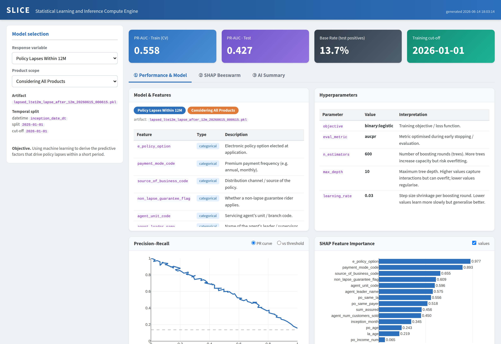

# SLICE — Statistical Learning and Inference Compute Engine

A Python generator that turns your lapse-model artifacts into a polished,
**self-contained, offline Quarto static website**.

The dashboard lets a user pick a response variable and product scope, then
explore that model's description, performance, SHAP explanations and an AI
summary — all from a single HTML file with **no server and no internet
required** (Plotly.js and the data are inlined at build time).

> **Live demo:** open [`docs/index.html`](docs/index.html) in a browser
> (built from the bundled sample data).



---

## What it builds

The flow mirrors the original specification:

1. **Model selection** — *Response variable* (Lapses within 12M / 4M) ×
   *Product scope* (All products / BAP only) → one of four models.
2. **Model & features** — feature list with descriptions (from the data
   dictionary), temporal split / cut-off date, and interpreted hyperparameters.
3. **Performance KPIs** — PR-AUC (train CV), PR-AUC (test), base rate, cut-off.
4. **Precision–Recall** — PR curve with a toggle to a precision/recall-vs-threshold view.
5. **SHAP feature importance** — mean |SHAP| bar chart (toggle value labels).
6. **SHAP beeswarm** — per-instance impact, coloured by feature value.
7. **AI summary overlay**
   - **A.** Model summary + confidence + model-explanation table
   - **B.** SHAP interpretation (top features) table
   - **C.** Suggestable audit areas table

---

## Inputs (per model)

All paths are **relative to a project base directory** and are configured in
[`slice/registry.py`](slice/registry.py). For each model the generator reads:

| Source | Used for |
| --- | --- |
| `Scripts/YAML_Archived/training_config_TS_*.yaml` | features, datetime field, `cutoff_date`, `train_test_split_date`, hyperparameters |
| `Reports/metrics_*.csv` | `cv_pr_auc`, `test_pr_auc`, `test_positive_rate` |
| `Reports/pr_data_*.csv` | `precision`, `recall`, `threshold` |
| `Reports/SHAP/*_importance_summary_*.csv` | `feature_rank`, `feature_name`, `mean_abs_shap_value` |
| `Reports/SHAP/*_values_detail_*.csv` | `feature_name`, `feature_value`, `shap_value` |
| `Reports/*_aiexplain_*.json` | `overall_summary`, `confidence`, `model_explanation`, `shap_interpretation.top_features`, `audit_suggestion.areas` |
| `Data Dictionary/data_dictionary.xlsx` | feature descriptions (rows where `Data Name == "Data"`, keyed by `Column`) |

Missing files never abort the build — the affected panel shows a clearly
marked placeholder and a warning is logged, so a partial data drop still
produces a working dashboard.

---

## Quick start

```bash
# 1. Install dependencies (plus the Quarto CLI: https://quarto.org/docs/get-started/)
pip install -r requirements.txt

# 2. (Optional) generate realistic sample data to try it out
python make_sample_data.py --base-dir sample_project

# 3. Build the dashboard
python generate_dashboard.py --base-dir sample_project --output-dir site
#    -> site/slice_dashboard.html   (open it directly, no server needed)
```

Point it at your real project instead:

```bash
python generate_dashboard.py --base-dir "/path/to/your/project" --output-dir site
```

### Options

| Flag | Default | Description |
| --- | --- | --- |
| `--base-dir` | `.` | Project root containing `Scripts/`, `Reports/`, `Data Dictionary/`. |
| `--output-dir` | `site` | Where the `.qmd`, assets and rendered HTML are written. |
| `--top-n-beeswarm` | `12` | Number of top features included in the beeswarm. |
| `--max-instances` | `300` | Max beeswarm points kept per feature (keeps the file small). |
| `--no-render` | off | Write the Quarto sources but skip `quarto render`. |
| `--quarto-bin` | `quarto` | Path to the `quarto` executable. |
| `--write-bundle` | off | Also write the raw `slice_data.json` (debugging). |

---

## How it works

`generate_dashboard.py` reads every artifact, consolidates them into one JSON
bundle, and writes a small Quarto project to the output directory:

```
site/
├── slice_dashboard.qmd   # custom-layout HTML page (the app shell, static)
├── slice_theme.css       # styling
├── _plotly.html          # Plotly.js, inlined (included in <head>)
└── _app.html             # the data bundle + JS controller, inlined (after body)
```

`quarto render` then produces a single **`slice_dashboard.html`** with
`embed-resources: true`, so everything (CSS, JS, data, Plotly) lives in that one
file. The interactivity is plain JavaScript driving Plotly — chosen over
Observable JS specifically so the page never needs a CDN at runtime.

To change which files map to which model, edit `slice/registry.py`.

---

## Project layout

```
generate_dashboard.py   # the generator (reads data → writes & renders the site)
make_sample_data.py     # fabricates a realistic sample project to demo with
slice/registry.py       # model ↔ file mappings + hyperparameter notes
requirements.txt
docs/index.html         # committed demo, ready for static hosting
```

## Publishing

The build output is a single static file, so hosting is trivial — e.g. GitHub
Pages serving the `docs/` folder, or any static host. The committed
`docs/index.html` is a ready-to-serve demo built from the sample data.
